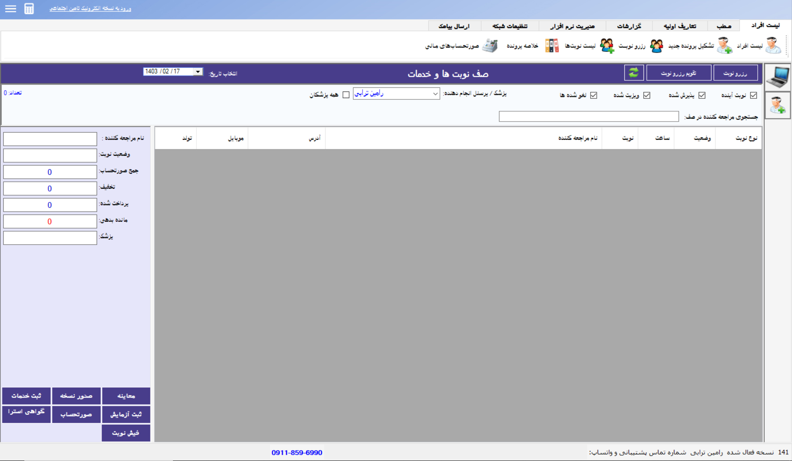

🔰This application was created by Alireza Alavi. In this project, I considered the client's needs and incorporated the following features:
-
1. Doctor/Doctors:
 
1. DoctorProfile: Doctor can see his own profile
 
2. PendingAppointments: Doctor can see all the pending appointments against his doctor ID.
 
3.TodaysAppointmemts: the appointments for current day will be shown.The doctor then can select/reject any appointment of that day
  
4. HistoryUpdate: He can update prescription,disease and progress of patient
  
5. GenerateBill: He will then generate the bill
  
6. PatientHistory: Doctor will be able to see the treatment history of all his treated patients.
 
 

2. Administrator:
 
1. Admin Home: Admin can view Clinic stats which includes weekly appointments, income of the Clinic. No of registered patients and doctors along with the list of departments
 
2. View Doctors: Admin can view the list of doctors currently registered along with their departments and other information. Complete profile will be shown when clicked.
 
3. View Patients: Admin can view the list of patients currently registered along with their phone numbers and ids. Complete profile will be shown when clicked.
 
4. View Other Staff: Admin can view other staff members along with their designations.
 
5. Search Box: Admin can search for a specific employ within the company by name
 
6. Add/Remove: Admin can Add/remove doctors patients and other staff members form the clinic.
7. 

 🛎️<b> Keep this in mind that I can't upload whole project (such as open source code) and It is specifically made for one of my clients</b>🛎️

<h2> Alireza's  <small> </small>Github Profile</small></h2>
 
  

<b>

<h2>🚀 Platforms</h2>

<h2>📄 Favorite Languages:</h2>

<h2>🌏 Find me</h2>

 
Hi there! I'm Alireza Alavi, Senior Robotic engineer with a passion for building innovative and user-friendly products. I'm proficient in Python, Java, and C++, and I have experience developing machine learning models.

I'm always looking for new challenges and opportunities to learn and grow. I'm also a big believer in open source software, and I'm always happy to contribute to projects that I'm passionate about.

Feel free to browse my GitHub profile to learn more about my work and experience. I'm always looking for new collaborators and contributors, so please don't hesitate to reach out if you have any questions or project ideas.

p.s: I'm currently working on a new Machine learning algorithm which use for prosthetic robotic hand and I'll share the project soon enough here.

<b>

